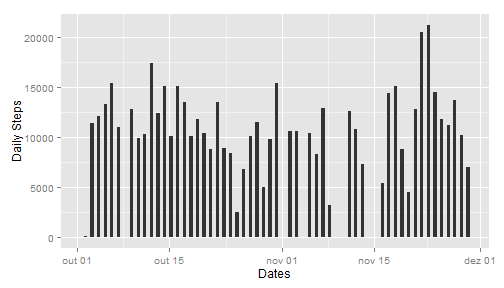
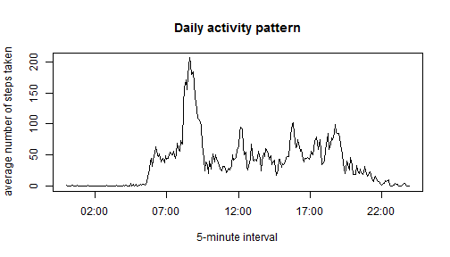
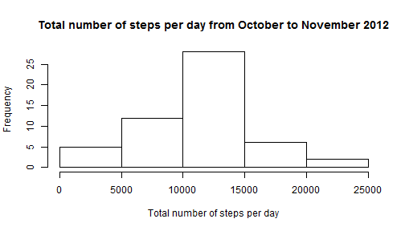
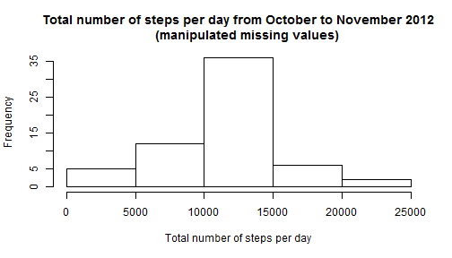

# Reproducible Research: Peer Assessment 1


## Loading and preprocessing the data


```r
data <- read.csv("activity.csv")
data2 <- na.omit(data) ##removing NA values
library(ggplot2)
library(plyr)
```


## What is mean total number of steps taken per day?


```r
x <- as.Date(data2$date)
steps <- data2$steps
dt <- data.frame(x, steps)
dd.agg <- aggregate(steps ~ x, dt, FUN = sum)
daily.steps <- dd.agg$steps
Dates <- x[!duplicated(x)]
table <- data.frame(Dates,daily.steps)
```


```r
qplot(Dates, data=table, geom="bar", binwidth = 0.5, weight=daily.steps,mean="Total number of steps taken per day", ylab = "Daily Steps")
```

 


## Calculate and report the mean and median total number of steps taken per day


```r
mean.daily.steps <- mean(daily.steps)
median.daily.steps <- median(daily.steps)
print(mean.daily.steps)
```

```
## [1] 10766
```

```r
print(median.daily.steps)
```

```
## [1] 10765
```

####The mean and median total number of steps taken per day is 10766.19 and 10765, respectively.


## What is the average daily activity pattern?


```r
interval <- data2$interval 
time <- strptime(sprintf("%04d", interval), "%H%M")
dtime <- data.frame(time,steps)
dtime.agg <- aggregate(steps~time,dtime,FUN=mean)
min <- time[!duplicated(time)]
hourly.steps <- dtime.agg$steps
```


```r
plot(min, hourly.steps, type="l", main="Daily activity pattern", xlab="5-minute interval", ylab="average number of steps taken")
```

 


## Which 5-minute interval, on average across all the days in the dataset, contains the maximum number of steps?

####08:35:00 with an average of 206.2 steps

## Imputing missing values


```r
n.na <- sum(is.na(data))
print(n.na)
```

```
## [1] 2304
```
 
####There are 2304 NA values in the dataset.
  
  

```r
z <- as.Date(data$date)
impute.mean <- function(z) replace(z, is.na(z), mean(z, na.rm = TRUE))
activity.imputed <- plyr::ddply(data[1:3], .(interval), transform,
                          steps = impute.mean(steps),
                          date = date,
                          interval = interval)
activity.imputed <- activity.imputed[order(activity.imputed$date,
                                           activity.imputed$interval),]
row.names(activity.imputed) <- 1:nrow(activity.imputed)
steps.imputed <- activity.imputed$steps
dd.imputed.agg <- aggregate(steps.imputed ~ z, activity.imputed, FUN = sum)
```


```r
hist(daily.steps, xlab="Total number of steps per day", main="Total number of steps per day from October to November 2012")
```

 

```r
hist(dd.imputed.agg$steps.imputed, xlab="Total number of steps per day", main="Total number of steps per day from October to November 2012
     (manipulated missing values)")
```

 
 

```r
mean.daily.steps <- mean(daily.steps)
median.daily.steps <- median(daily.steps)
mean.imputed <- mean(dd.imputed.agg$steps)
median.imputed <- median(dd.imputed.agg$steps)
    print(mean.daily.steps)
```

```
## [1] 10766
```

```r
    print(median.daily.steps)
```

```
## [1] 10765
```

```r
    print(mean.imputed)
```

```
## [1] 10766
```

```r
    print(median.imputed)
```

```
## [1] 10766
```

####This values differ from the estimates from the first part of the assignment. With the manipulated missing values, mean and median are equals.


##Are there differences in activity patterns between weekdays and weekends?


```r
activity.imputed$weekdays <- weekdays(z)
activity.imputed$n.weekdays <- as.numeric( format(z , "%w") )
dweekday <- data.frame(activity.imputed$n.weekdays,steps.imputed)
dweekday.agg <- aggregate(steps.imputed~interval+n.weekdays,activity.imputed,FUN=mean)
dweekday.agg$interval <- strptime(sprintf("%04d", dweekday.agg$interval), "%H%M")
stat <- subset(activity.imputed, n.weekdays < 6 & n.weekdays>0)
```
